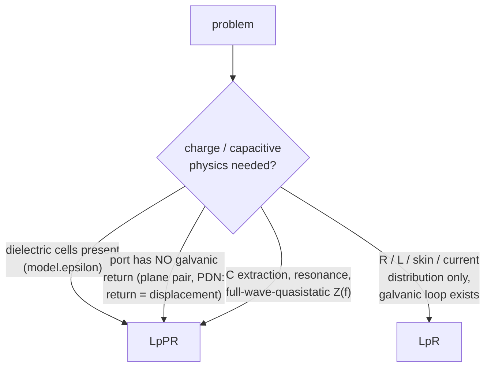
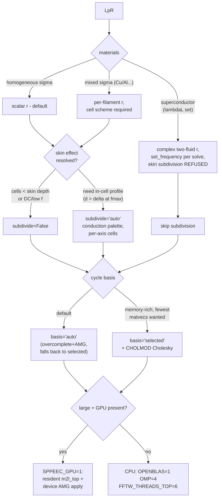

# SuperPEEC solver decision tree

Every supported problem class, the path it takes, and every setting
that changes along the way. Grouping is deliberate: configurations
listed together are handled identically. Every bifurcation below is a
real code-path or settings difference. Status: 2026-08-08, after the
dielectric program, the hole-augmented basis, the band-W rhs fix, and
the Schur-ordering study.

Dimensions covered: formulation (LpR / LpPR), scheme (cell / edge),
materials (homogeneous / mixed sigma, superconductor, dielectric),
cell shape (cubic / anisotropic), geometry (compact / flat / needle,
perforated or not, multiply-connected or not, multi-conductor),
size (small / medium / large), frequency band (vs the wL/R crossover
and vs cavity resonance), skin-effect resolution, and hardware
(memory ceiling, GPU).

---

## 0. Root: which formulation?



Hard rules, enforced by guards:

* Pure-dielectric cells -> **LpPR only** (`EquiTerminalSolver`
  raises: an excess-capacitance branch without its bound charge is
  not a dielectric).
* Port P and N on galvanically separate conductors with no stitching
  -> **LpPR only** (LpR raises `no return path`). Adding decap
  stitching vias makes the LpR loop measurement valid again
  (`build_pdn(stitch=N)` pattern).
* Magnetic materials: **not supported** (relegated; PyPEEC wins
  there for now). Multi-dielectric eps-contrast interfaces (two
  different eps_r touching): **not supported** (`|2-2| = 0` fires no
  panel) — single dielectric + vacuum + conductor only.
* Scheme: `SPPEEC_SCHEME=cell` for everything below. The edge scheme
  is deprecated, refuses material IDs (mixed sigma, dielectrics),
  and exists only for the legacy byte anchors.

---

## 1. LpR branch (`equiterminal.EquiTerminalSolver`)



Settings detail:

| decision | grouped configurations | setting / consequence |
|---|---|---|
| conductivity | homogeneous vs mixed | automatic (`resistances()`); mixed needs cell scheme (guard) |
| superconductor | any lambdaL | complex r via `impedance_density`; kinetic L exact; `subdivide` refused |
| skin resolution | wires/conductors thicker than delta | `subdivide='auto'` (conduction palette, 93% delivered); frequency-retuning automatic; anisotropic cells supported; use generous `rc` on staircased wires |
| anisotropic pitch | `VoxelModel.d` per-axis | native; aspect-compensating leaves automatic; accuracy ~1e-3 at 2:1, ~5e-3 floor at 4:1; skin engine refused |
| multiply-connected conductor (holes: antipads, slots) | any | automatic since 2026-08-08: tree-cotree hole generators complete the overcomplete basis (`nholes` reported); `selected` always worked |
| multi-conductor | separate components | spanning FOREST automatic; per-port component guard |
| flat / needle geometry | thin boards, coils | `partition()` pancake escape automatic (incl. collapsed-clamp boards < 9 cells thick); 2-D FMM, top level cheap |
| size: small (< ~50k cells) | — | defaults fine; single/2-level tree |
| size: medium (50k–1M) | — | 3-level tree automatic; CPU knobs `OPENBLAS_NUM_THREADS=1` in solve, `OMP=4`, `FFTW_THREADS_TOP=6` |
| size: large (1M–10M+) | — | matvec scales (3.1M cells: 9 s); **setup (loop Cholesky) dominates** -> `basis='auto'`/overcomplete (AMG; ~10x less memory, ~1.5–2x matvecs); `SPPEEC_GPU=1` for AMG apply (34x) and m2l_top (22x) on compact trees; on pancake trees GPU gains are small (~8%) |

---

## 2. LpPR branch (`SystemMat` + `port_impedance.LpPRSolver`)

### 2a. Tree / memory (choose FIRST — this is the binding constraint)

```mermaid
flowchart TD
    P[LpPR] --> T{cells}
    T -- "small: < ~30k" --> T1[single-level tree\ndense n2n\nexact W - numpy Cholesky]
    T -- "medium: ~30k - 500k" --> T2[multilevel FMM tree\nnear n2n ~ 27*leaf^3/node\n(33 GB @ 400k, leaf 5)]
    T -- "large: > ~500k" --> T3[circulant single-level\n(20 GB @ 400k) --\nBUILD SLOW: 87 min @ 400k,\nprofiling docketed]
    T2 --> W{n2nchol exists?}
    T1 --> WE[wsolve='exact' auto]
    W -- "yes (rare: compact,\nno dielectric layers)" --> WE2[wsolve='exact' auto]
    W -- "no (thin geometry,\ndielectric node layers)" --> WB[wsolve='band' auto\n+ true-residual postcheck]
    T3 --> WB
```

* Guard: an orientation with ZERO filaments (1-cell plates over an
  empty gap) is refused — thicken the plates.
* `LpPRSolver` handles the band-W rhs convention internally
  (`rhs = W*(P*injections)`); the true-residual postcheck runs on
  every solve (`info['true_residual']`) and warns loudly if the W is
  too weak. Never bypass it.
* Krylov memory: fgmres keeps ~`2*restrt*wholesize*16 B`. At >= 1M
  unknowns use `restrt<=100, maxiter=3..5` (restart 200 at 1.5M
  unknowns OOM'd a 62 GB box).
* Dielectric accuracy law: C within +-5% of converged truth at 1–4
  cells across the dielectric (BEM-validated); multilevel operator
  seam ~1e-3 (part E).

### 2b. Preconditioner / frequency (then choose this)

The crossover is geometric: f_c ~ where wL/R = 1 per cell,
f_c ∝ 1/(sigma d^2) — ~60 MHz at 50 um copper cells, ~1 GHz at
12.5 um.

```mermaid
flowchart TD
    F{dielectric cells?} -- yes --> DD["precond='diagschur' at ALL\nfrequencies (reluctance is\nINCOMPATIBLE with dielectric\nbranches -- guard raises;\nmaterial-split hybrid docketed)"]
    F -- no --> FC{frequency vs crossover}
    FC -- "f << f_c\n(resistive regime)" --> D[precond='diagschur']
    FC -- "f >~ f_c\n(inductive regime)" --> R[precond='reluctance']
    FC -- "near/above first\ncavity resonance" --> RES[reluctance +\nccap='band' or 'full']
    D --> DC{ccap}
    DD --> DC
    DC -- "small (< ~50k ext nodes)" --> DC1[ccap='diag' ok]
    DC -- "at scale" --> DC2[ccap='band' REQUIRED\n(diag needs dense eye-probe:\n684 GiB @ 300k ext)]
    DC -- "many frequencies, scale" --> DC3[sdsolve='amg'\n(guarded, falls back)]
    R --> RO["Schur ordering: MMD_ATA\n(in code since 2026-08-08)"]
```

**Measured 2026-08-08 (160^2 filled board):** reluctance +
dielectrics = true residual 0.52 at full budget (N_Z models every
branch as metal; dielectric branch admittance is ~10 orders away).
`LpPRSolver` now refuses the combination. For dielectric boards
above the crossover, diagschur remains correct with growing counts
(154 @ 160^2/1e8); the material-split hybrid (K~ on metal rows +
exact diagonal on dielectric rows) is the docketed path.

| decision | grouped configurations | setting / consequence |
|---|---|---|
| diagschur | f << f_c, any materials incl. superconductor + dielectric | complex-r probe fixed 2026-08-08 (subtracts r before reading Lp); `_Rdiag` refreshes per frequency (dielectric r is f-dependent) |
| reluctance | f >~ f_c | Schur factor ordering **MMD_ATA** — the old MMD_AT_PLUS_A is 58–90x slower on PERFORATED geometry (antipads/vias/slots derail greedy minimum degree: 2550 s vs 44 s at 99k nodes) while still best on unperforated compact volumes; MMD_ATA is robust everywhere measured. cholmod-METIS comparable (33 s) if a new path is ever needed. Dielectrics do NOT enter S~ values — only the graph size |
| ccap='full' | small near-resonance studies | dense P_ext^-1 block; O(n_ext^2) |
| per-frequency cost | reluctance & diagschur both refactor S per frequency | reluctance S~: ~44 s @ 100k nodes (MMD_ATA); diagschur S_d: 7-point, cheaper; sweep warm-starting is the open lever |
| flat geometry | boards, planes | pancake trees automatic; part-E seam applies |
| anisotropic pitch | capacitive path | **CAUTION: not explicitly validated** (aniso program validated the inductive path; panels carry per-axis pitch but no capacitive aniso gate exists) |
| GPU | LpPR matvec | only the traverseRL half has a GPU path; traverseP3 GPU port is docketed; diagschur/reluctance applies are CPU sparse |

### 2c. Known open items on this branch

* Multilevel capacitive memory (27*leaf^3 per node) is the scaling
  wall; smaller leaves shrink it; circulant build time (87 min @
  400k) needs profiling before circulant is the default at scale.
* `ccap='diag'` silent OOM deaths at 320^2 (two independent
  configurations) — suspected S_d fill spike; low priority since
  band is the at-scale route. Possibly the same perforation/ordering
  pathology as the reluctance Schur (S_d also uses MMD_AT_PLUS_A);
  untested.
* Warm-started frequency sweeps: designed, not implemented.
* diagschur-vs-reluctance matvec crossover on filigree boards:
  measurement in flight (160^2, this session).

---

## 3. Size classes, summarized across both branches

| size | LpR | LpPR |
|---|---|---|
| small (< 30–50k cells) | anything; defaults | single-level, exact W, ccap='diag' fine |
| medium (to ~500k) | defaults + CPU knobs; overcomplete if memory-tight | multilevel + band W + ccap='band'; watch near-field n2n RAM (leaf size) |
| large (0.5–3M+) | overcomplete/AMG; GPU on compact trees; setup dominates | multilevel with restart<=100 (33 GB @ 400k) or circulant (20 GB, slow build); band W + postcheck mandatory-in-practice |
| beyond (10M+) | matvec fine (6.4M: 9 s, 15.5 GB); solve setup is the frontier | uncharted; memory law says circulant or smaller leaves |

## 4. Quick invocation reference

```python
# LpR port solve
S = EquiTerminalSolver(model, M, port, basis='auto',
                       subdivide='auto')
z, i, info = S.solve(freq)

# LpPR port solve (dielectrics, PDN, capacitive)
M = model.build_tree(leaf, levels, capacitive=True)   # or circulant=True
model.prepare(M, freq)
S = LpPRSolver(model, M, precond='diagschur'|'reluctance',
               ccap='band', wsolve='auto',
               sdsolve='auto'|'splu'|'amg')   # TOML: [solve] schur_solver
# sdsolve='auto' (default, 2026-09-13): exact LU of the nodal Schur
# complement below systemmat.SCHUR_AUTO_NODES (50 000) nodes, smoothed-
# aggregation k-cycles at or above; the SA contraction probe (rho < 0.5)
# falls back to the LU with a warning. S.schur_state says which ran.
# Why the gate: the LU fill grows N^1.6 (253 MB at 24k nodes, 7.4 GB at
# 192k), the hierarchy ~1.2x nnz(S_d). Measured on dielectric plate
# pairs SA does NOT contract (rho 0.6-0.8 even after equilibration), so
# dielectric boards currently fall back to the LU.
z, x, info = S.solve(freq, restrt=100, maxiter=3)
# ALWAYS check info['true_residual']
```

Environment: `SPPEEC_SCHEME=cell` (always), `SPPEEC_GPU=1` (opt-in),
`SPPEEC_MODE_APPLY_GPU=0` (opt-out: the enrichment's FFT mode apply
runs on the card by default when there is one -- its km + 3 padded-grid
complex128 slabs were 3.1 GiB per matvec on the RSFQ XNOR, the largest
single item of that solve; device agreement 6e-16, 8x faster on the
JTL; host fallback on any device failure), `SPPEEC_LEAF_PATH=gather` (A/B only: restores the per-filament leaf
gather buffer that the 2026-09-14 GEMM contractions retired -- 2.4 GiB
on R4 and the XNOR, see memory_census_r4.md), `SPPEEC_GPU_LEAF=1`
(opt-in on top of the GPU: the chunked leaf GEMMs run on the card; a
speed option, nothing is left to move for memory),
`OPENBLAS_NUM_THREADS` / `FFTW_THREADS_TOP` per the CPU-track notes.

## Leaf box size: peak RSS and wall time (2026-09-09)

`partition()` picks the leaf by occupancy (5 cells above 50% fill, 8
between 5% and 50%, 16 below; per axis by pitch on anisotropic
cells). Re-measured with `SPPEEC_NLEAF=a,b,c` (a study override on
`Problem.tree`) on the RSFQlib JTL, configuration A, 100 nm cubic
cells, 1.12M occupied of a 222 x 720 x 34 box (20.7%), 10 GHz, one
process per point, L within 2e-4 across every row:

    leaf (cells)   boxes          setup s  solve s  wall s  peak GB  matvecs
    3              75 x 241 x 12     196      328     525    10.22     89
    4              56 x 181 x 9      144      151     297     6.62     57
    5              45 x 145 x 7      125      107     232     5.90     57
    6              38 x 121 x 6      119      134     254     5.83     88
    8 (the rule)   28 x 91 x 5       114       95     210     5.53     57
    10             23 x 73 x 4       114       94     209     5.21     57
    12             19 x 61 x 3       114      125     239     5.32     88
    16             14 x 46 x 3       119      104     224     5.33     57

Small boxes cost in both currencies (leaf 3: 2x the peak and the
wall of the rule's choice); from 8 up the peak is flat within 6%
with its minimum at 10, and the wall is flat except where the
matvec count jumps to 88 (leaves 6 and 12 -- the far-field
truncation shifting the Krylov path, not the tree's cost). The rule
sits at the knee; a leaf of 10 buys 6% of memory and no time.
RSFQ XNOR (100 x 100 x 67.5 nm cells, 4.93M occupied of 21.9M,
22.5%), two larger leaves against the rule's 5 x 5 x 8:

    leaf (cells)     boxes            setup s  solve s  wall s  peak GB  matvecs  L pH
    5 x 5 x 8 (rule) 125 x 145 x 7     1195     2087    3287    20.34     137    1.66421
    7 x 7 x 10        89 x 104 x 5     1012     1829    2842    18.53     136    1.66440
    10 x 10 x 15      63 x 73 x 4       999     1804    2804    18.15     126    1.66439

On both models the rule's leaf sits below the knee: boxes 25-90%
larger than the rule's cost 9-11% less peak and 14-15% less wall on
the XNOR, and are flat-to-better on the JTL, with L moving at the
far-field truncation level (1e-4). The rule's 8-cell leaf for the
5-50% fill band dates from a time-only study whose worst case was a
leaf of 2; raising it to 10 (per axis by pitch as now) is the
candidate change, a doctrine decision -- the anchors and every
recorded timing would re-base.

DBC R4 (wire-bond path, 62.5 x 62.5 x 40 nm cells, 51M box), the
rule's 5 x 5 x 8 against larger leaves, whole-process wall:

    leaf (cells)     boxes          wall s  peak GB  matvecs  R mOhm    L nH
    5 x 5 x 8 (rule) 65 x 81 x 7     1678    18.3      163    5.16578   20.0903
    8 x 8 x 12       41 x 51 x 5     1254    15.93     189    5.17834   20.0837
    12 x 12 x 18     27 x 34 x 3     1241    15.88     222    5.1803    20.0779
    16 x 16 x 24     21 x 26 x 3     1578    16.21     244    5.18954   20.0778

The peak saturates from 8 x 8 x 12 upward (-13%; 16 x 16 x 24 turns
back up as the matvec count climbs to 244) and the wall drops 25% at
8-12, but R drifts +0.24% / +0.28% / +0.46% and L -3e-4 / -6e-4 with the leaf
-- larger than the XNOR's 1e-4, so on this path the leaf's accuracy
cost must be measured against a converged reference before a rule
change. R5 (3.9x R4's box) at the saturated peak projects to ~62 GB:
still not the 62 GB box (55 free).

The drift IS accuracy, measured on R3 (2026-09-09): the multipole
order moves R by 0.016-0.018% at either leaf (nmax 6 against 4), the
wire segmentation by 0.01% (12 x 12 x 18 with segments pinned to the
rule leaf's 0.625 mm cap: 5.05827 against 5.05877 mOhm), while the
leaf moves it 0.3% -- and models without bond wires drift 1e-4. The
mechanism is the wire coupler's near/far boundary, which is the
tree's 27-box rule: its far field is the three-point-source
approximation from two boxes outward, so a larger leaf pushes it
farther out. R3 converges from below with the leaf:

    leaf (cells)     boxes         wall s  peak GB  matvecs  R mOhm    L nH
    5 x 5 x 8 (rule) 65 x 81 x 11   523     5.29     143    5.04333   20.0890
    8 x 8 x 12       21 x 26 x 4    266     3.89     172    5.05585   20.0855
    12 x 12 x 18     14 x 17 x 3    325     5.02     195    5.05877   20.0849
    16 x 16 x 24     11 x 13 x 2    287     7.78     200    5.05949   20.0833
    20 x 20 x 30      9 x 11 x 2    545    11.25     200    5.05998   20.0840

The limit is 5.060 mOhm; the rule's leaf is 0.33% low. Memory and
time have a band, best at 1.5-2x the rule's leaf and worse again
beyond it, where the near-field workspaces of 27 large boxes take
over (16 x 16 x 24: 7.8 GB, 20 x 20 x 30: 11.3 GB on R3).

The rule's own shapes on R3 (per-axis cubic boxes, leaf0 x dmin):

    leaf0            R3 leaf      wall s  peak GB  matvecs  R mOhm
    8 (the old rule) 5 x 5 x 8     523     5.29     143    5.04333
    10               4 x 4 x 10    401     4.17     156    5.05119
    12 (the rule)    5 x 5 x 12    269     3.98     167    5.05276
    16               6 x 6 x 16    282     3.87     177    5.05339

**The rule's leaf0 for the 5-50% fill band is 12 since 2026-09-09.**
On the wire-bond path it halves R3's wall and takes a quarter off
its peak while moving R 0.2% toward the converged value; on the JTL
and the XNOR it sits inside the flat band (the JTL's time optimum was
10, 12 within 15%). The dense (> 50%) and sparse (< 5%) bands were
not re-measured and keep 5 and 16.
Every wall time and peak recorded in the documents before 2026-09-09
(examples campaign, memory census, trace example, this study's own
"rule" rows) was taken at leaf0 = 8 for this fill band; the R3 and R4
re-runs at the new rule are the reference from here on.

### Capacitive trees and thin boards (2026-09-13)

`VoxModel.partition(capacitive=True)` -- what `Problem.tree` passes on the
LpPR path -- keeps leaf 5 regardless of fill: the 12/16 bands above were
measured on the inductive near field, and the capacitive tree's measured
configuration (33 -> 0.2 GB lean at the 320^2 board) is leaf 5. Two
related guards, found the hard way: a collapsed isotropic clamp (leaf <
3, i.e. a thin board) on a model above 10 000 occupied cells now always
takes the thin-axis escape instead of a single-level tree, whose
capacitive near field is dense in the occupied nodes (51 GB in
`p2pinit3` on a 12k-cell 80^2 pdn); and the 8 -> 12 leaf change had
moved the 320^2 pdn's escape test (321/12 = 27 boxes < 32) back to
single-level -- fixed by the same guard. Compact models and all
anchors keep their trees.

### LpPR setup memory under band W (2026-09-13)

`diagschurprecinit(ccap='diag')` used to obtain the diagonal of C_cap by
probing `_pext_solve` with a dense identity, which under the band W of
the lean tree forms W @ I -- a dense next x next transient (14.0 GB at
19k external nodes on the 80^2 FR4 pdn, for a 0.8 GB resident solver).
It now reads diag(W) directly, bit-identical (same matvecs, residual
and Z on that board), so the lean LpPR path's setup is O(next) again.

### The Schur factor's hidden 4 GiB (2026-09-14)

`_factorDiagSchur` factors S_d with SuperLU under the MMD_AT_PLUS_A
ordering. In SuperLU's default UNSYMMETRIC mode that factor's internal
supernodal storage was 15x its own L+U nnz: on the 160^2 FR4 pdn (99k
nodes) 308 s and +3.94 GiB resident for a factor that exports as 0.27
GiB -- and the census could not see it (it lives inside the SuperLU
object, entered by memcensus only since today). `options=
dict(SymmetricMode=True)` on the same ordering: 1.7 s, +0.36 GiB, the
same nnz. S_d is structurally symmetric, so that is now the call.
Orderings on this board for the record: COLAMD 4.2 s / +0.70 GiB,
MMD_ATA 4.4 s / +0.73, NATURAL 44 s / +2.26, MMD_AT_PLUS_A unsymmetric
308 s / +3.94, MMD_AT_PLUS_A symmetric 1.7 s / +0.36.

## Multipole order nmax (2026-09-10)

`SPPEEC_NMAX` beside the leaf override; the default is 4. At the new
leaf rule:

    model      nmax   peak GB  wall s   matvecs  R / L
    R3           3      3.91     258      167    5.05282 mOhm / 20.0859 nH
    R3           4      3.98     269      167    5.05276      / 20.0863
    R3           6      6.18    1038      167    5.04850      / 20.0862
    XNOR         3     17.17   (shared)   126    L 1.66412 pH
    XNOR         4     18.42   (shared)   126    L 1.66425 pH

nmax 3 against 4: 1e-5 on R3, 8e-5 on the XNOR, for 6.8% of the
XNOR's peak (the harmonic count (nmax+1)^2 is 16 against 25: the
leaf gather buffers -36%, the M2L spectra (2 nmax+1)^2 -40%) and a
few percent of wall. nmax 6 on R3 moves R DOWN 0.08% while the leaf
ladder moved it UP toward 5.060: raising the order converges to the
wire coupler's point-source far-field model, enlarging the leaf to
the exact kernels, and the 0.2% between them is that model's bias,
which nmax cannot remove. The default stays 4; nmax 3 is a measured,
cheap memory knob.

### R5 feasibility (2026-09-10)

R4 at the new leaf (8x8x12), all three memory levers stacked:

    config                          peak GB   wall s  matvecs  R mOhm
    nmax 4, GMRES (reference)        15.93     1254     189    5.17834
    nmax 3, BiCGSTAB                 15.45     1060     178    5.18898
    nmax 3, BiCGSTAB, GPU leaf       14.46     1015     178    5.18898

The levers return 1.5 GB of 15.9 (9%), not the 30% the census
arithmetic promised: the R4 peak is set by the assembled solver
(loop basis, preconditioner, spectra), of which the leaf gather and
the Krylov basis are minor shares. R5 has roughly 3.9x the occupied
cells of R4, so its projected peak is ~56 GB host against 55 GB
available on the 62 GB box: NOT launchable here in any configuration.
CORRECTION (2026-09-15): the two "BiCGSTAB" rows above ran lgmres --
the wire-bond sweeper did not forward `[solve] method` until that day
(the equipotential sweeper did), so their 178-vs-189 matvecs and the
1.2x wall were nmax 3 alone. The real BiCGSTAB numbers for R4 are in
the memory survey's campaign log (internal_docs).

R5 was then tried by hand (nmax 3, BiCGSTAB, GPU leaf) and died in
the first matvec with cupy OutOfMemory, 11.57 GB held on the 12.3 GB
RTX 4070 SUPER: the CARD, not the host (40 GB RSS at that point),
is the binding limit. VRAM profile of R4 in the same configuration
(1 s nvidia-smi sampler): 0.48 GB idle, 2.22 GB after the GeoMG
hierarchy upload (1.77 GB), 6.25 GB flat through the Krylov (leaf
gather 1.65 GB = 12.9 M filaments x 16 complex64 harmonics, the
rest the P2P slab spectra, index packs and the cupy pool). R5 has
4.0x the filaments and a 7.46 GB GeoMG hierarchy: ~23 GB of VRAM
with the GPU leaf, ~16 GB without. Neither fits. The only R5 path
on this card is SPPEEC_GPU_BUDGET_GB=3 (forces the GeoMG apply to
the CPU fallback, ~3x slower solve), no GPU leaf (host +6.6 GB),
P2P on the device: ~50 GB host, several hours, untested.

## The streamed Krylov basis (2026-09-15)

`[solve] method = "gmres_stream"` (`krylov_stream.gmres_stream`) is
full GMRES within the same matvec budget as lgmres, with the Arnoldi
basis written one vector per record to an unlinked file under
`SPPEEC_STREAM_DIR` (default `~/.cache/sppeec/krylov`; NOT the system
temp directory, which is a RAM-backed tmpfs on the development box).
About five complex128 work vectors and one complex64 read buffer stay
in memory whatever the iteration count, so the solve phase no longer
grows with the iteration count at all: on R3 the resident set at the
start of each matvec was 2.13 GiB at the first and 2.18 GiB at the
last, where lgmres climbs ~0.18-0.26 GiB per iteration on the
flagships (its basis was 2.5 GiB on R4, 3.4 GiB on the XNOR).

Three things decided the design, each measured on the DBC R3 at
1 MHz, rtol 1e-4, against an lgmres reference at rtol 1e-7 (463
matvecs, R 5.04916 mOhm, L 2.00861 nH):

    solver                              matvecs   R mOhm     R error
    lgmres(10), the default                167    5.04931    +0.003%
    streamed, RIGHT-preconditioned          97    5.04283    -0.125%
    streamed, left, complex64 arithmetic   602    5.04791    -0.025%  (stalled, budget)
    streamed, left, complex128 arithmetic  138    5.049176   +0.0003%

1. Precondition on the LEFT, like lgmres. GMRES minimises the norm
   it iterates in; the preconditioned residual |P^-1 r| is close to
   the error itself, so minimising it shapes the error away from
   the slow global directions the resistance functional reads,
   whereas the textbook right-preconditioned form minimises |r| and
   left 40x more error in R at the same true residual (L, 96% of
   |Z| at this frequency, was unaffected either way). Termination
   stays on the true residual: one extra matvec plus a pass over
   the basis, every ten steps and whenever the tracked ratio of the
   two norms predicts convergence (with a 0.8 margin -- the ratio
   drifts as the solve closes in).
2. Arithmetic in complex128, storage in complex64. A full cycle in
   single-precision arithmetic stalled at |P^-1 r|/|b| ~ 1e-4 for
   hundreds of steps: the Arnoldi relation only holds to single
   precision over a long cycle, and lgmres only survives in single
   because it restarts every ten steps. With the inner products,
   Gram-Schmidt updates and Hessenberg in double, the stored basis
   rounded once per vector floors the true residual at ~3e-8 -- the
   same floor the single-precision lgmres basis has, and the same
   `precision = "auto"` rule (double storage below rtol 1e-5) covers
   it.
3. Never trust a residual prediction alone. The ratio |P^-1 r|/|r|
   taken from the initial residual (a rough port injection) is
   pessimistic by up to 5x for the late residual (smooth, in the
   directions the preconditioner amplifies most); a solver that
   only checked when the prediction said so marched blind to the
   300-matvec budget (24 minutes on R3).

Cost: the Gram-Schmidt reads k vectors at step k, k^2/2 vectors per
cycle in total. The kernel's page cache serves the reads from RAM
while the box has room and evicts under pressure; the process RSS
never sees them (positional reads, not a memory map). A first version
did the projections as a numpy loop, one vector at a time: 0.12 s per
R4-sized vector (every vector moved through memory three times in
complex128 on one core), which made the orthogonalisation cost as
much as the matvec on R4 and more on the XNOR (solve 1222 s against
971 s for lgmres). The shipped version reads the basis in blocks (at
most 512 MB of complex64 vectors, on four threads -- page-cache
copies are single-core bound) and does the projections and the
update in `krylov_kernels.f90`, an OpenMP kernel that streams the
block once per pass in the stored precision and accumulates in
double: 0.037 s per vector, 0.026 of it the read. Build it with
`make -f Makefile_multipole krylov_kernels`; without the module the
solver falls back to the numpy loop. Wall-time comparison against
lgmres on the same code: see the table below (measured after the
kernel).
Not the default: lgmres remains the default for the same reason
BiCGSTAB is not -- the streamed basis is the scalability option, for
solves where the Krylov basis is what does not fit.

Measured with the solve survey (one frequency, the box otherwise
idle, the same code for every row; "numpy" = the first orthogonal-
isation, "kernel" = the shipped one):

    flagship   method             matvecs  solve s  s/step  peak GiB  answer
    DBC R3     lgmres(10)            167      168    1.01     2.97    R 5.049315 mOhm, L 2.008609 nH
    DBC R3     streamed, numpy       138      240    1.75     2.45    R 5.049176, L 2.008611
    DBC R3     streamed, kernel      133      159    1.20     2.68    R 5.049174, L 2.008611
    DBC R4     lgmres(10)            178     1016    5.74     9.37    R 5.178324, L 2.008375
    DBC R4     streamed, numpy       133     1332   10.09     8.17    R 5.178328, L 2.008375
    RSFQ XNOR  lgmres(10)            126      986    7.89    11.71    L 1.664255 pH
    RSFQ XNOR  streamed, numpy       100     1222   12.34    10.42    L 1.664252 pH

The R4 and XNOR rows with the kernel were not measured (the user
judged the wall-time question settled by R3); from the per-vector
benchmark the kernel removes ~4 of the 5 s of per-step overhead on
R4, which would put the streamed solve below lgmres there too, as it
is on R3 (159 against 168 s: fewer matvecs, and 26 s of reads plus
projections over the whole solve against 130 s in the operators).

The peak has LEFT the solve phase on R4: it falls 92 s into the run,
in the build, and the solve phase sits flat between 5.2 and 5.8 GiB
where lgmres ends at 8.96. On R3 the kernel version's peak is 0.23
GiB above the numpy one's: the block read buffer (at most 512 MB,
`SPPEEC_STREAM_BLOCK_MB`). The answers agree with lgmres to 1e-6 on
R4 and 2e-6 on the XNOR, where BiCGSTAB moved R by 2.5e-4 and L by
3.5e-4. The R3 R values are all within 0.003% of the 1e-7 reference;
the streamed ones within 0.0003%.

## The build transient: the loop-Gram hierarchy on the card (2026-09-15)

With the streamed basis the R4 peak had left the solve phase and sat
in the build, inside the wire-bond solver's construction on the first
solve call. A build survey (RSS marks on every constructor step,
aborting at the first matvec, 3 minutes on R4) attributed it, in GiB
resident before / peak inside / after each step:

    step                                    in    peak    out
    wire coupler tables                   0.82    2.17   1.89
    incidence / spanning forest           1.89    5.14   2.70
    loop basis (_build_cycles)            2.75    6.02   3.00
    plaquette geometry                    5.26    6.58   5.62
    Gram product on the host              5.04      --   6.30
    hierarchy build (GeoMG.__init__)      6.30    8.17   7.00
      of which stencil extraction         6.24    8.10   7.00
    macro Schur loop (host V-cycles, 32 s)  7.00    7.00   7.00
    GPU upload, then host release         7.00    7.73   5.65

The peak was two host transients of 1.5-1.9 GiB (the Galerkin coarse
product and the stencil certification) on a base that existed only
because the full plaquette Gram lived on the host until its upload:
the GPU core wanted level 0 as a host CSR, while the CPU path had
long avoided the Gram (tier 3: stencil from a sampled basis product,
coarse levels by colour probing).

Now (port_impedance._GeoMGFactor, gpu_amg, loopmg.GeoMG) the GPU
path never forms the Gram on the host: `gpu_amg.gram_on_device`
builds level 0 on the card from the basis in row chunks (the full
product at R4 size needs 8.7 GB of pool for a 1.5 GB result; 1M-row
chunks stay under 4 GB), `gpu_amg.device_galerkin` takes level 1 as
P0^T A0 P0 on the device (exactly what the colour probes assembled,
verified bit-identical, without their 81 host passes and int64
triplet lists), the hierarchy constructor takes that through its new
`coarse0` hook (`mv0` is the matvec-probing variant), no host stencil
is built, and the macro Schur block is assembled through the device
V-cycles. The same survey afterwards:

    hierarchy build (GeoMG.__init__)      5.84    7.01   6.25
    GPU core                              5.85    6.02   5.90
    geometric factor, total time          42 s -> 5 s

R4 peak 8.17 -> 7.01 GiB; R3 answer and matvec count unchanged
(R 5.04931 mOhm, L 2.00861 nH, 167). SPPEEC_KEEP_HOST_COPIES=1
restores the host stencil path (validate_gpu_geomg compares host and
device applies through it); a device failure at any step falls back
to it with a warning. Device memory during the build: the Gram (1 GB
at R4) plus the chunked product's buffers; R5 remains out of this
card's reach for the reasons in the R5 section.

What sets the R4 build peak now, in order: the hierarchy
constructor's aggregation and level bookkeeping (a 1.2 GiB sum of
mid-sized temporaries), the plaquette geometry (6.44), and the loop
basis construction (6.02 on a 2.75 base -- the largest single
transient left in the build, 3.3 GiB).

### The particular current on the card (2026-09-16)

The loop basis construction (`WireBondSolver._build_cycles`) was the
largest single transient left in the R4 build, 3.3 GiB on a 2.75 GiB
base: the node Laplacian's pyamg smoothed-aggregation setup (2.05 GiB
of temporaries, a 0.64 GiB hierarchy, 28 s) plus the float64 incidence
transpose and the Laplacian itself on the host, all for the one-time
potential solve that gives the smooth particular current ihat_f = B phi.

A tree current was tried first -- the feasible pattern read off the
spanning forest, no matrix, no solve (subtree sums of the injections
by one triangular solve in the pointer-jumped depth order). It
satisfies KCL to 1e-14 and is REJECTED: R3 took 299 matvecs against
167 and R moved 5.7%, because the port readout V = ihat . v uses this
pattern as its test vector and a rough one amplifies the residual
error. "Any feasible pattern is equally valid" holds in exact
arithmetic only; the smooth potential-flow pattern is load-bearing.
It stays as SPPEEC_IHAT=tree for reference.

Shipped: the same Laplacian solve on the device
(`wireassembly._laplacian_current_gpu`). The incidence goes up once in
chunks, B^T B is formed there, grounded through the forest's roots
(one per component, isolated nodes their own -- no host
connected-components pass), solved by Jacobi-preconditioned CG in
float64 to 1e-12, and the current and its KCL residual are formed
there too. Measured on R3's captured system (923k nodes, 6M nnz):

    solver                                  time    host RSS   KCL resid
    pyamg SA + CG (before)                 7.2 s   +0.44 GiB   2e-13
    pyamg lean (fp32, unsmoothed) + CG    24.8 s   +0.30 GiB   5e-12
    device CG + Jacobi, 3300 iterations    1.1 s   +0.00 GiB   5e-14

R4 build survey: the step's transient 3.3 -> 0.5 GiB, 33 -> 22 s; R3
answer and matvec count unchanged (167), wall 3:45 -> 3:26. The run
peak stays at 7.06 GiB, now set by the GeoMG constructor's aggregation
bookkeeping (5.90 -> 7.06) with the plaquette geometry close behind
(6.76): the next two build targets, ~1.2 GiB of temporaries each.
SPPEEC_IHAT=amg keeps the pyamg construction, which is also the
fallback on any device failure.

## The device ledger (2026-09-16)

The memory survey now covers the card (device used, cupy pool in use
and held, device items by attribute path). Measured peaks on the 12 GB
RTX 4070 SUPER, GiB: R3 card 3.04 / live 1.15 / resident 0.78; R4
5.52 / 3.06 / 2.07; XNOR 8.71 / 5.77 / 1.96. The card's peaks are
transients and pool cache, not resident structures: R4's first reading
was 8.31 because the row-chunked Gram product's cuSPARSE work buffers
stayed cached in cupy's pool at odd sizes for the whole product --
`gpu_amg.gram_on_device`, `device_galerkin` and
`wireassembly._laplacian_current_gpu` now return the pool's free blocks
after every chunk, and the pinned host pool after the transfers (its
cache was +0.4 GiB of unattributed host memory on the XNOR). The
XNOR's card peak is the mode apply's five complex128 padded-grid slabs
per matvec (2.7 GiB) cycling through the pool through the whole solve.
Resident: the GeoMG level 0 (R4 1.2 GiB), the mode spectra (XNOR 1.35),
and the top-level FMM transfer table in complex128 everywhere (R3
0.40). R5 on this card would need level 0 in int8 data or the
two-card split, before the FMM device tables and leaf data.

### The XNOR's preconditioner on the card (2026-09-16)

The device ledger showed no GeoMG hierarchy on the card for the RSFQ
XNOR, and an instrumented build survey showed why: `GPUGeoBlock`
declined any factor with an identity set (columns the caller
preconditions itself), and the equipotential path passes its
redistribution modes as exactly that set. So the XNOR's macro Schur
block was assembled by 1720 s of host V-cycles (29 of the build's 31
minutes), every preconditioner apply ran on the host with its 0.57
GiB transient, and none of the device-side GeoMG changes above ever
reached it. The block now passes the identity set through unchanged
(`out[rest] = b[rest]`), and the factor no longer excludes it.

    RSFQ XNOR, 1 frequency        before      after
    solver build                  1069 s      268 s
    solve (126 matvecs)           1024 s      581 s
    whole run                     2105 s      862 s
    host peak                    12.21 GiB   11.71 GiB
    card peak / resident          8.7 / 2.0  10.3 / 3.6 GiB
    L                             unchanged to 1e-8

The card is now the XNOR's tight resource: the build peak is the
row-chunked Gram product beside the resident spectra (the chunk
default went from 1M to 500k rows, `SPPEEC_GRAM_CHUNK_ROWS`), and the
solve holds the spectra, the hierarchy and the mode apply's slabs.

## Without a card: host paths of comparable memory (2026-09-16)

Several of this week's memory wins moved work to the device, and a
user without a GPU (or with a small one) must not pay the old host
peaks for them. Status of each device path's host twin:

    device path                      host twin                             memory parity
    streamed Krylov basis            host-only by construction             yes
    GeoMG hierarchy (Gram on card)   tier 3: stencil, probed coarse levels yes (never forms the Gram)
    wire-bond particular current     Jacobi-CG with the threaded csrmv     yes (was pyamg: 2.05 GiB on R4)
    mode apply (XNOR)                lean input slabs at rtol >= 1e-5      partial: -0.8 GiB/matvec of 2.7

`wireassembly._laplacian_current_cpu` is the host twin of the device
Laplacian solve: B^T B once, grounded through the forest's roots,
Jacobi-CG with loopmg's threaded csrmv. On R3's captured system 22.5 s
and +0.06 GiB against pyamg's 7.2 s and +0.44 GiB (28 s and 2.05 GiB
on R4). It is the CPU default (SPPEEC_IHAT=cg; =amg keeps pyamg; the
device path falls through to it on any failure).

The mode apply's INPUT spectra slabs (U and F) are now taken in the
stored spectra's precision (complex64) with the accumulation kept in
complex128, on both the host and the device path -- but only when the
solver has declared an engineering tolerance (rtol >= 1e-5, the same
policy as the Krylov basis; `enrich._slab_dtype`, set from the three
Krylov call sites). Measured: at oracle tolerance the rounded inputs
put ~1e-7 into the operator and validate_corner's 1e9 solves stall at
a 1e-7 residual; at rtol 1e-4 the XNOR keeps its 126 matvecs and its
answer to 1e-8. SPPEEC_MODE_SLABS=fp64|lean overrides. The rest of
the host apply's transient (the complex128 accumulators and the FFT
outputs) needs the tiled convolution to go further.

Measured, one frequency, the same code, SPPEEC_GPU=0 against the card:

    flagship    host peak, card   host peak, no card   solve wall, card / no card   answer
    DBC R3         3.21 GB            3.15 GB             3:26 /  28:37             identical, 167 mv
    DBC R4         9.42 GiB          10.34 GiB           1116 s / 7085 s            to 6e-7, 178 mv
    RSFQ XNOR     11.71 GiB          15.34 GiB            581 s / 2346 s            to 1e-8, 126 mv

(lgmres, the default, on all rows; the streamed basis takes ~2.3 GiB
off R4 and ~3 GiB off the XNOR on either path.) The no-card excess is
what the card would otherwise hold -- the XNOR's spectra (1.35 GiB)
and hierarchy, R4's stencil tables -- plus the host apply's larger
per-matvec transient on the XNOR, plus 0.40 GiB of plaquette basis the
factor keeps on the host path for no reason (next batch). The wall
gap is the host V-cycle preconditioner and is not a memory matter.

## The remaining host items on the flagships (2026-09-16, item 3)

Four changes, one of them general:

* **`spmv.spmv_c`: a real sparse matrix times a complex vector as two
  real products.** scipy's CSR/CSC matvec kernels take one data type,
  so a float64 basis times a complex128 vector first converts the whole
  data array to complex128: measured at R4 size (48M nonzeros) a
  +0.89 GiB transient per product against +0.36 as two real products,
  0.21 against 0.17 s. Both loop-basis operators (wire-bond `Bmat`,
  equipotential `Y`/`YT` and the Gram-correction products) now use it.
  R4 solve survey: the operator's per-matvec transient 0.90 -> 0.42
  GiB, memory survey peak 9.42 -> 8.94 GiB (lgmres), same 178 matvecs,
  answer to 4e-7, +1.4% wall.
* **The equipotential loop block as VIEWS.** `_Yl`/`_YlT` were a
  row-sliced copy of Y's loop columns and a transposed copy; the loop
  columns are a prefix of the CSC arrays and carry no mode rows
  (asserted), so both are now views over Y's storage. They are created
  lazily in the Gram-corrected readout at the end of a solve, so on
  the XNOR this takes 0.75 GiB off the resident set AFTER the solve
  (6.70 -> 5.95 GiB, what a second frequency of a sweep would carry)
  and not off the single-frequency peak (11.71 -> 11.61).
* **The preconditioner apply writes its two halves straight into the
  complex output** (`_precond`, and the Gram-correction `pre`):
  `float64(re) + 1j*float64(im)` made four full-length temporaries,
  0.58 GiB per apply on the XNOR whose vector carries tens of millions
  of mode columns. Not the XNOR's peak-setter -- that is the
  operator's 1.17 GiB transient (the device mode apply's host side and
  the tree/coupler temporaries) -- so it lowers the apply, not the
  peak. Measured apply transient after: see below.
* **The plaquette basis is dropped on the CPU path** once the
  hierarchy exists (it was only ever needed to build a device level
  0): -0.40 GiB resident on R4 without a card.

The XNOR's per-matvec picture after this (solve survey, device paths):
operator 1.17 GiB (of which the mode apply 0.40), preconditioner
0.38 GiB (was 0.58; the rest is the mode block's own product output). What is left on the XNOR is the operator's transient and
the lgmres basis (the streamed basis removes the latter). Peaks now, GiB:
R3 2.7 (streamed) / R4 8.94 (lgmres) or ~7.1 (streamed) / XNOR 11.61
(lgmres) or ~8.6 (streamed).

## The last two R4 build transients (2026-09-17, item 4)

After the hierarchy moved to the card, the R4 build peak (7.06 GiB)
sat in two places: the hierarchy constructor's aggregation
bookkeeping and the plaquette geometry, ~1.2 GiB of temporaries each.
Both were int64-and-copies problems:

* `loopmg.plaquette_geometry` gathered the four edge cells of every
  plaquette into an (nplaq, 4, 3) int64 array (1.15 GiB at 12M
  plaquettes) to take a min over the edges; it now runs the min/max
  one edge at a time and returns int8 normals and int32 cells: the
  step's transient 1.2 -> 0.3 GiB, its resident result 0.36 -> 0.16.
  Verified identical to the old output on R3's basis.
* `GeoMG._aggregate` built the prolongator as COO triplets (three
  8-byte arrays of n0) and converted; it now writes the CSC directly
  (one entry per row, so the column pointers are the aggregate sizes
  and the row indices the rows sorted by aggregate) with float32
  ones. The constructor also stops copying the normal and base arrays
  before aggregating. Hierarchy verified identical (every P and every
  level) to the old code.
* Both callers passed `Bmat[:efg, :nplaq].tocsc()`, a 0.4 GB copy; a
  column prefix of a CSC matrix is contiguous, so `spmv.csc_prefix`
  hands the geometry a view (equal to the copy, asserted to carry no
  row beyond the filaments).

R4 build survey (in / peak / out, GiB):

    step                     before                after
    plaquette geometry    5.26  6.44  5.62      4.87  5.19  5.03
    GeoMG.__init__        5.84  7.01  6.25      5.52  6.36  5.95
    run peak                    7.06                  6.36

What sets the R4 build peak now: the constructor's remaining 0.84 GiB
(np.unique on the 12M keys, the level-1 download and casts), then the
KCL check (5.30) and the spanning forest (5.03). The R3 answer is
5.04932 against 5.04931 mOhm, 2e-6 within the 1e-4 tolerance, with
the geometry and hierarchy bit-identical: rounding in the solve, not
in what is built.

### The streamed basis, hardened (2026-09-17)

Three things the campaign's closing measurements turned up, all in
`krylov_stream`/`gpu_amg` now:

1. **A true-residual stall guard.** Left preconditioning minimises
   |M r|, close to the error, which is why the answers come out so
   accurate -- but the true residual, the tolerance's quantity, can
   trail it: on R4 two runs sat at |r|/|b| ~1.5e-4 for 100+ steps
   while |M r| fell to 1e-6, where a third run had converged in 133
   and R3 always does. The stored complex64 basis's rounding
   accumulates over a long cycle (a unit case that floored at 3e-8 in
   one cycle reached 4e-10 after a restart). So: three consecutive
   true-residual checks without a 2% improvement end the cycle and
   restart from the best iterate (`SPPEEC_STREAM_STALL_CHECKS`,
   `_STALL_TOL`); a cycle that stalls again ends the solve with flag 2
   and `krylov_solve` hands the iterate to lgmres. R4 with the guard:
   176 steps to the stall, a restart, 15 more -- 191 matvecs, the
   same as lgmres (178 or 189), the answer to 1e-5 of it.
2. **A memory-bounded cycle length.** The basis file is only fast
   while the page cache holds it; the wire-bond path's budget of 600
   steps let a stalled cycle grow to 40 GB on this 62 GB box and
   every later step read the whole basis from the drive. The cycle
   length is now the smaller of the budget and half the memory
   available at solve time divided by the vector size
   (`SPPEEC_STREAM_BYTES`, `SPPEEC_STREAM_RESTART`).
3. **A bit-reproducible device preconditioner.** The streamed cycle is
   a sensitive detector of a preconditioner that is not the same map
   on every apply. Measured on R4: the device GeoMG apply differed by
   3e-6 relative between two applies of the same vector; every
   V-cycle product, the coarse solve and the forward macro product
   were bit-reproducible, and the culprit was the macro block's
   transposed product -- six rows of millions of nonzeros, which
   cuSPARSE reduces with atomics even as a CSR. It is now one
   fixed-order reduction per row (`gpu_amg._rows_dot`) in both device
   blocks, and the apply reproduces bit for bit. The same
   non-reproducibility is why R4 lgmres took 178 or 189 matvecs on
   identical runs (one cycle either side of the tolerance).

Measured on the final code (memory survey, one frequency, the box
otherwise idle): R4 streamed 220 matvecs, solve 1584 s, host peak 6.9
GiB (the build; lgmres 178-189 matvecs, 1116 s, 8.9-9.4 GiB); XNOR
streamed 100 matvecs, 594 s, 10.2 GiB (the build; lgmres 126, 581-691
s, 11.6 GiB); R3 streamed 132, 159 s, 2.7 GiB (lgmres 167, 168 s,
3.0). The streamed basis remains the scalability option, not the
default: flat in the iteration count, the run peak moved into the
build on both large flagships, and now guaranteed to terminate on the
true residual -- at the price, on R4, of the guard's restart and the
reads of a 200-vector basis per step.

## CPU-only wall time: the profile and the first levers (2026-09-17)

Without a card the R3 solve took 1436 s against 168 s with one, at the
same 167 matvecs. A CPU-only solve survey attributed it (per matvec):

    phase                       card       CPU before    CPU after
    preconditioner apply       0.09 s        6.54 s        0.94 s
    operator (matvec)          0.89          2.12          2.11
      of which P2P (x3)        0.11          0.33          0.34
      of which top-level M2L     --          0.25          0.25
    solve total                168 s        1436 s         510 s

The preconditioner apply was 75% of the CPU solve, at 70x the card's
cost while the operator was only 2.4x. Inside one apply: two complete
four-cycle V-cycle solves (the local block and the macro correction),
each 1.7 s, 98% of it the level-0 stencil kernels running at ~3
GFLOP/s -- the reduction over the stencil entries was the innermost
loop, with runtime offsets, which does not vectorise. Measured
non-levers: 12 OpenMP threads instead of 4 gain 35% on the stencil and
lose more on the sparse levels; two V-cycles per apply halve the apply
but cost 167 -> 230 matvecs, a wash once the apply is one solve.

Shipped:

1. **The macro correction from kept columns.** The Schur assembly
   already solves M B e_j for every macro column; the columns are kept
   (float32, within SPPEEC_MACRO_COLS_MB = 512 MB, so R3/R4's six but
   not the XNOR's hundreds) and the apply's correction yp - M(B ym) is
   a dense (nloc x nmac) product instead of a second V-cycle solve.
   Host apply 3.48 -> 1.52 s; the device block uses them too.
2. **Vectorisable stencil kernels** (STENMV/STENJAC, _S and _D): the
   stencil entry is now the OUTER loop and the contiguous X index the
   innermost, so each inner loop is a stride-1 saxpy with loop-
   invariant offsets. Sweep 0.169 -> 0.062 s, one V-cycle solve
   1.71 -> 0.61 s; host apply 3.48 -> 0.62 s with (1). The summation
   order changed, so the stencil is now always certified to tolerance
   against the matrix path, never bitwise.
3. **The top-level M2L kernel threaded** over its 25 output channels
   (bit-identical; FMMtop now built with -fopenmp). (The split below
   later showed the kernel, not the FFTs, was still most of that
   phase: 0.25 of 0.39 s per call on R3, memory-bound.)

R3 CPU-only, whole run: 28:37 -> 17:20 (1) -> 9:34 (1+2+3), against
3:26 with the card; answer and matvec count unchanged. What is left
on the host, in order: P2P at 3x the card's per-call cost (170 s of
510), the top-level M2L's FFTs (125 s), the apply's remaining 0.9 s
(155 s). R4 and the XNOR are not yet re-measured CPU-only.

## CPU-only wall time, second batch: the near field and the top-level M2L (2026-09-17)

With the apply fixed, the host operator was the CPU-only solve: on R3,
P2P 170 s and the top-level M2L 125 s of 510. A per-call split of one
near-field call (leaf e, R3, 0.68 s on a loaded box) put a third in the
Fortran kernel, a quarter in the six staged FFT passes, and 38% in
nothing at all: every slab of every matvec allocated three fresh
FFTW-planned buffers for the source and three for the target, zeroed
them and copied a -> b -> c between the stages -- 1.3 GB of page-faulted
memory per call. The top-level M2L's kernel streamed its whole transfer
table once per (n,m,j,k) pair: 5.9 GB per call on R3, memory-bound at
23 GB/s. Threads: 4 beat 8 and 12 for both phases (the kernels are
bandwidth-bound), so the no-GPU thread policy stands.

1. **Near-field kernel on contiguous planes** (`mp_fortran` P2PCORE /
   P2PAXPY): the slab choice (behind / current / ahead) is made once
   per neighbour instead of per grid point, and the inner loop is a
   stride-1 complex axpy over one padded plane. P2PINTO writes into
   the caller's buffer (no per-slab output allocation); the capacitive
   near field uses it too. Kernel 0.23 -> 0.11 s per call.
2. **Four single-buffer workspaces per call** (`toeplitz.ToeplitzSlab`):
   the padded transform staged in place on views of one buffer, no
   inter-stage copies, 4/7 of the three-buffer memory; three source
   slots and one target, sized to the largest slab, allocated once per
   call and released at its end, used through leading-axis views. A
   first version cached them across calls keyed by slab size, which
   held 38 workspaces per orientation on R4 and raised that run's peak
   from 10.1 to 12.3 GiB: caches keyed by a varying size are measured
   for retention on the flagship before they stay.
3. **Plane-tiled top-level M2L** (`FMMtop.M2L`): each thread takes one
   X plane and a run of Y columns short enough that the 131 table and
   spectrum segments it needs stay in L2, and applies all (n,m,j,k)
   pairs to that segment. Kernel 0.29 -> 0.07 s per call.

All three agree with the old kernels to fp64 rounding (4e-16 relative
on R3; the compiler's FMA contraction and FFTW's plan choice on views
differ), not bit for bit; the near/far-field validators pass. Clean
per-call numbers on R3: near field 0.346 -> 0.208 s, top M2L
0.242 -> 0.136 s.

| model, CPU-only whole run | before this campaign | batch 1 | batch 2 |
|---|---|---|---|
| R3 (167 mv, same answer) | 28:37 | 9:34 | 7:35 |
| R4 (peak 10.1 GiB) | 1:58:28 | 51:51 | 42:47 |

R3 solve after batch 2 (survey): matvec 1.45 s (P2P 0.22 and top M2L
0.14 per orientation), apply 0.92 s -- the preconditioner is again the
largest single phase (152 of ~400 s), followed by the rest of the
matvec (P2M/L2P/M2M/L2L and the mode stacks).

## A second device backend: the seam (2026-09-17)

The device paths were written directly against CuPy, so they run on
NVIDIA and nowhere else. Porting them to OpenCL brings in AMD and Intel
Arc parts, and the survey that preceded the work found the decisive
fact: there are no custom CUDA C kernels anywhere in the tree. No
`RawKernel`, no `ElementwiseKernel`, no `RawModule`. Every device
operation is composed from CuPy and cuPyx library calls, so there is no
CUDA source to translate, only library surface to re-supply.

`src/backend.py` is the seam, and after this change it is the only
module in `src/` that imports CuPy. It resolves which library drives
the device and hands out what the call sites need: the array and sparse
namespaces, the device count, a placement context, free-memory queries,
pool release and scatter-add. `gpu_xfer` takes its array module from
here when the caller does not name one.

`SPPEEC_BACKEND` selects: `auto` (the default) means CUDA when CuPy
reports a device and host paths otherwise, which is exactly what this
code did before the seam existed; `cuda` and `none` say so explicitly;
`opencl` is opt-in and never chosen implicitly, so no existing install
can change what it runs by accident. `SPPEEC_GPU` keeps its meaning as
the master gate and is re-read on every query rather than cached, so a
process that flips it mid-run still sees the change.

Two places needed more than a namespace swap. The tree cost model asks
for total VRAM as a hardware fact, so it uses a query that deliberately
ignores the master gate and still answers when `SPPEEC_GPU=0`. And
`cupyx.scatter_add` became `backend.scatter_add`, which is the one
place to record that CUDA runs it with atomics: the order is not fixed,
repeated calls are not bit-reproducible, and it must never appear
inside the preconditioner apply, whose map has to be identical every
call or a long GMRES cycle stalls.

What OpenCL cannot supply directly, in descending order of difficulty:
there is no maintained sparse library, so the per-matvec need (a CSR
product) becomes one hand-written kernel and the build-phase products
stay on the host at first; there is no portable free-memory query, so
the two placement heuristics that branch on it move to a declared
budget; and the multi-device split relies on implicit peer-to-peer
copies between CuPy device contexts, which has no analogue. The
determinism constraint argues *for* the port: a hand-written product
with one work group per row is reproducible by construction, which is
what the cuSPARSE atomics workarounds in `gpu_amg` exist to recover.

Measured before starting, on an RTX 4070 SUPER, to check that OpenCL
gives up nothing: a fused complex128 multiply-accumulate reaches 436.8
GB/s against CuPy's 290.2 for the same expression, because CuPy
materialises the temporary and makes two passes; a batched 3-D
transform at the top-level M2L's own shape takes 3.10 ms under VkFFT
against cuFFT's 4.2. The port is not a concession, and fusing is where
its upside lies.

## The OpenCL operator: fused kernels, and what that is worth (2026-09-18)

With the seam in place the operator phases were rewritten for OpenCL
rather than transliterated. The distinction is the whole point. A CuPy
expression materialises every temporary and reads it back, and that is
why the card returned only about twice the host's speed while holding
ten times its memory bandwidth: the top-level M2L moved roughly 14.7 GB
per call on R3 for arithmetic that needs 0.6.

Measured per call on R3, one run at a time:

| | host | CuPy/CUDA | OpenCL |
|---|---:|---:|---:|
| near field, leaf e | 219.1 ms | 112.7 ms | 30.3 ms |
| top-level M2L | 133.5 ms | 54.4 ms | 19.3 ms |

**Top-level M2L** (`ocl_m2l`). Each work group takes a tile of grid
points, stages their translation-channel spectra and their moments in
local memory, and computes one output harmonic per work item. A grid
point then reads its `nt` channels and `nn` moments once instead of
being walked through `(nn, G)` temporaries `nn` times. 27 kB of local
memory at nmax 4 with a tile of 16.

The channel spectra are the largest device allocation in the corpus, so
the operator is **resident when it fits and streamed when it does
not**, chosen against a card budget (`SPPEEC_OCL_M2L` forces either
form). Streaming keeps the operator on the host and uploads one channel
per matvec, holding three work grids instead of the whole table: 42%
less card at both R3 and R4, which at R4 is 165 MB down to 96. (An
earlier version of this paragraph, and the commit that introduced it,
said 2.93 GB down to 1.70. That was arithmetic from a guessed top-grid
size, not a measurement; R4's padded top grid is 78 732 points, not the
1.4 million I assumed. The proportion was right and the absolute was
eighteen times too large.) The
streamed kernel walks only the pairs that map to the channel in hand,
about eight of the 625, so it does the same arithmetic as the resident
contraction rather than the redundant dense per-channel product the
CuPy streamed path uses; each work item owns one grid point and walks
its pair list in a fixed order, so it stays reproducible. It costs
about three times the wall on that phase, 21 to 66 ms on R3, and is
paid only when the resident form will not fit.

**Near field** (`ocl_p2p`). The loop runs over target boxes rather than
over neighbour directions, so each work item accumulates its own box in
a register and nothing is scattered. That removes the pair array CuPy
materialises and, with it, `scatter_add` and its atomics.

**Mode blocks** (`ocl_modes`). The km-by-km convolution, contracted one
output harmonic at a time into a single accumulator. The device state
is keyed to the spectra generation, because the spectra are rebuilt per
frequency and a cached upload would otherwise be applied to the next
one.

These padded grids are the largest device allocation in the corpus, 3.1
GiB per matvec on the XNOR by the memory survey, so this module is
sized for the card. The first cut was not: it forced every grid to
double precision and held a second stack of km grids for the outputs,
which cost 1.35 GiB of card on the one model already at 78% of it. Both
are fixed. The input slabs now carry the stored spectra's precision,
single at engineering tolerances, with the transforms still running in
double and rounded on the way into the slab exactly as the host does;
and the single accumulator replaces the second stack, at the price of
km separate inverse transforms rather than one batched pass.

Worth recording that the double-precision version was not more faithful
for being wider. The host reads those slabs in single precision by
design, so forcing double made the result *differ* from it by 1e-8;
matching its economy brought agreement to 4e-16.

Agreement with the host is 6e-16 relative for the two FMM phases and
1e-8 for the mode apply, the latter being the floor set by the
complex64 spectra it reads. None is bitwise equal to the host and none
can be: different transform library, different summation order.

The enriched bar example, five frequencies, agrees across all three
backends to six digits, which also exercises the per-frequency spectra
rebuild.

The kernels are, however, **bit-identical on a repeated call**, which
the CuPy near field is not, because it reduces with atomics in whatever
order the hardware delivers. `validation/validate_backend.py` checks
this explicitly. It matters for phase 2: a preconditioner whose map
drifts between applies breaks the Arnoldi relation of a long GMRES
cycle, and writing the products output-centric gives reproducibility by
construction rather than by workaround.

R3 end to end on OpenCL returns 0.00504932 at 167 matvecs, the host
answer exactly, in 5:07 against CUDA's 3:19 and the host's 7:35. OpenCL
is ahead on every phase it owns and behind on the whole run because the
preconditioner is still on the host; that is phase 2, and it accounts
for about 2:20 of the 5:07.

Two PyOpenCL details worth knowing. `prg.kernel_name(...)` builds a
fresh kernel object on every call, which costs real time at one enqueue
per slab per matvec, so handles are taken once. And `.data` on a sliced
device array is the whole buffer, not the slice, so stack offsets are
passed to the kernels explicitly.

## The OpenCL preconditioner (2026-09-18)

The survey that shaped this phase found something that made it much
smaller than expected: the device multigrid apply takes a real float32
vector and returns one. The complex system is preconditioned through a
real map, and the macro Schur solve is small, dense and host-side. So
the preconditioner needs no complex sparse support at all, and its only
per-apply sparse operation is a matrix-vector product. The sparse
matrix-matrix products are build-phase and stay on the host.

`ocl_sparse` supplies the products as hand-written kernels: CSR
matrix-vector, a fused damped-Jacobi sweep, the residual, an
accumulating product for prolongation, a dense product for the coarse
level, and gathers and scatters. One work group per row, a fixed number
of work items striding its nonzeros, then a fixed binary tree in local
memory.

Writing them by hand is the point rather than the price. Reproducibility
stops being a workaround and becomes a property of the code. The CUDA
path materialises the macro transpose as its own matrix and walks its
rows through a Python loop, both purely because cuSPARSE reduces long
rows with atomics and a preconditioner that is not the same map every
call breaks the Arnoldi relation of a long GMRES cycle. Neither
workaround is needed here, and the macro transpose runs at full width.

The fixed tree is also more accurate than the serial reference. Against
fp64 truth on the case that caused the trouble, six rows of 250 000
nonzeros:

| | relative error |
|---|---:|
| scipy, serial fp32 | 6.9e-6 |
| this kernel, fp32 | 5.1e-7 |

`ocl_geomg` mirrors the CUDA core and block onto those kernels: the same
V-cycle in the same order, the macro Schur factor and the kept macro
columns still on the host. The apply agrees with the host apply to
3.3e-7 relative and is bit-identical on a repeated call.

Level 0 is applied as a stencil, not as a matrix (`ocl_stencil`). The
plaquette Gram is translation invariant, so the host never forms it:
it packs the vector into per-normal dense 16-cubed tiles and applies 36
constant-coefficient slots with a one-cell halo from the 27 neighbouring
tiles. That is the memory win the compression campaign bought, and the
OpenCL path keeps it rather than forming the Gram on the host and
uploading it.

The halo is read through the neighbour table rather than staged in
local memory: a padded tile carries three normals over (TL+2) cubed
cells, 70 kB at TL 16, and a work group gets 48 kB. Each work item owns
one output cell and resolves each slot itself, wrapping an out-of-range
coordinate into whichever of the 27 neighbours it names. Absent
neighbours and absent plaquettes are zero, so nothing needs masking.

Because the slots run in the same build-time verified order as the
Fortran kernel, the two agree **bit for bit**, and the stencil is 6.9x
the host matvec and 3.7x its sweeps.

Forming the Gram on the host remains as a fallback for a geometry with
no certified stencil, bounded by `SPPEEC_OCL_GRAM_GB` (default 2) above
which the apply refuses and the caller falls back to the host.

Single device only; the CUDA path's two-card split relies on implicit
peer-to-peer copies between CuPy device contexts and has no analogue.

R3 end to end, one run at a time:

| | wall | peak RSS |
|---|---:|---:|
| host | 7:35 | 3.5 GB |
| CUDA | 3:19 | 3.1 GB |
| OpenCL | 2:49 | 3.0 GB |

OpenCL is ahead of CUDA on both, and the flagship R4 agrees: 18:09 and
10.2 GB against CUDA's 18:20 and 9.7, at the same 178 matvecs.

Getting there needed one fix worth recording, because it is the OpenCL
twin of a lesson this tree already learned for CUDA.
``pyopencl.array.to_device`` creates the buffer with the host pointer
copied in, and the runtime keeps that host copy resident for the life
of the buffer: 1.5 GB of resident memory for a 1.5 GB array, still
there after the host array is freed and after a trim. On R4 the
top-level M2L's channel spectra alone are 1.8 GB. Allocating the
buffer empty and filling it by copy costs nothing resident, so
``ocl_core.to_device`` does that, in slices, exactly as
:mod:`gpu_xfer` does for the CUDA driver's staging arena. R3 peak 3.7
to 3.0 GB, R4 11.9 to 10.2.

What found it was the census: the object totals matched between the two
backends to within 0.3 GiB while anonymous memory differed by 2.2, so
whatever held it was not a Python object the census could see.

## The device sparse-sparse product (2026-09-18)

`ocl_sparse.spgemm` and `ocl_sparse.transpose` are the OpenCL
equivalents of the two build-phase products the CUDA backend runs on
the card: the Gram when no certified stencil is available, and a
Galerkin coarse operator. Both are formed once per solve, never per
apply.

The design follows the matrices rather than the textbook. A plaquette
touches four filaments, so a Gram row is the 36-slot stencil, and the
aggregation is 0/1 with a handful of entries per column: the rows are
short. So one work item owns one output row and keeps its column set in
a small sorted private array, inserting with a binary search. No hash
table, no segmented sort, and no scratch proportional to the expansion.
It is deterministic by construction, and a row that exceeds the private
bound raises rather than writing something wrong, so the caller widens
the bound or falls back to the host.

Entries that cancel to exactly zero are pruned, because scipy prunes
them and a hierarchy should not depend on which backend assembled it.
With that, the results match scipy exactly, structure and values, and
repeated builds are bit-identical. Device-resident forms
(`spgemm_device`, `transpose_device`, `gram_device`) let a Gram chain
stay on the card from end to end, which matters because a Gram is
gigabytes at flagship scale.

**What this does not fix.** It was reached for on the theory that it
would close the roughly 0.6 GB by which R4 on OpenCL still sits above
CUDA. Inspection did not support that: the host multigrid's coarse
build already avoids a Gram-sized product, colour-probing through the
stencil at a transient near 100 MB rather than 1.8 GB. The gap remains
unattributed.

Its wiring today is correspondingly narrow. The multigrid core uses it
for the level-0 Gram when no stencil certifies, which keeps that matrix
off the host entirely; but when a stencil fails to certify the host
multigrid has usually formed a Gram itself already, so removing that
needs a change there rather than in the backend. The product's present
value is as a building block and as the parity item for retiring the
CUDA path.

## The wire-bond particular current on OpenCL (2026-09-18)

`ocl_wire` solves `(B^T B) phi = rhs` for the node potentials on the
wire graph and returns `ihat = B phi`, with the tree roots held at
zero. The incidence transpose and the graph Laplacian are formed on the
card through the device sparse product, so the host holds neither.

The Dirichlet condition is applied in place rather than as two more
matrix products. Zeroing a root's row and column and putting one on its
diagonal is a scaling of each entry by the two endpoint flags plus a
correction on the diagonal, which is one pass over the entries instead
of assembling `D L D`.

The solve is the same Jacobi-preconditioned conjugate gradient with the
same convergence test as the CUDA path. Against the host solve on a
synthetic wire graph it agrees to 2e-15, the KCL residual is 1e-13, and
repeated solves are bit-identical.

Two notes. PyOpenCL's own reductions need the Mako templating engine,
which this tree does not carry, so the dot product and the maximum
magnitude are local kernels: a fixed number of work groups, each
reducing through the same tree, then a fixed-order sum of the partials.
Same answer every call. And the Gram-on-the-card branch in the
preconditioner factory is now gated to CUDA, because the OpenCL path
applies level 0 as a stencil and never forms the Gram; it was
previously attempted and warned on every OpenCL run.

R3 end to end, one run at a time:

| | wall | peak RSS |
|---|---:|---:|
| host | 7:35 | 3.5 GB |
| CUDA | 3:19 | 3.1 GB |
| OpenCL | 2:34 | 3.1 GB |

This is the first OpenCL run with no fallback warnings at all.


## The frontier is the card, not the host (2026-09-19)

Measured across the corpus, with the card at 12 GB and the box at 62:

| model | card used | of card | host peak | of host |
|---|---:|---:|---:|---:|
| R3, OpenCL | 2.77 | 23% | 2.89 | 5% |
| R4, CUDA | 5.33 | 44% | 8.87 | 14% |
| R4, OpenCL | 4.39 | 37% | 10.14 | 16% |
| XNOR, CUDA | 9.30 | 78% | 11.28 | 18% |
| XNOR, OpenCL | 8.42 | 70% | 12.63 | 20% |

The card runs three to four times hotter than host memory, and the XNOR
has about 3.5 GiB of headroom. Another refinement step of the size that
took R3 to R4 multiplies cells by five, which needs roughly 22 GiB of
card and roughly 51 of host: the host fits on this box and the card
misses by a factor of two.

So the compression work that matters now is device-side. In order: port
the streamed form of the top-level M2L operator, which CUDA has and
this backend does not, and whose channel spectra are 1.8 GB at R4 and
grow with the top grid; look for other operators held as data that
could be applied instead, as level 0 now is; and take the single
precision device path, which halves the streaming phases and was until
now filed only as a portability item for Intel parts.

One caveat on the level-0 stencil: it does not certify on the XNOR's
geometry, so that model holds a materialised Gram on both backends and
the saving the stencil gives on R4 does not transfer there.
