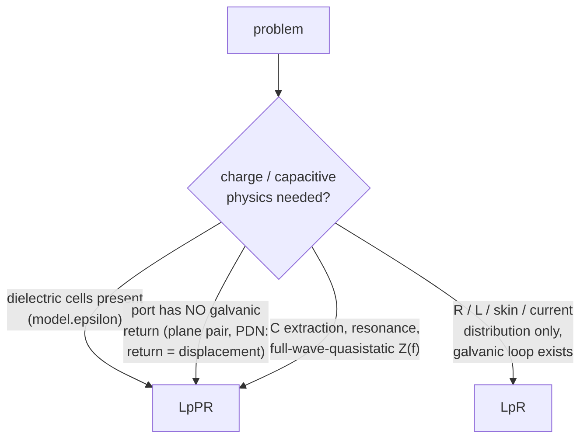
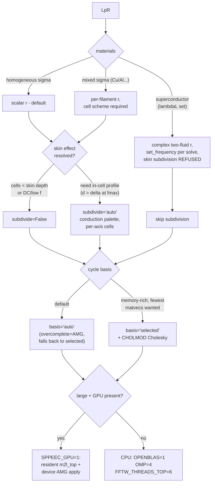

# SuperPEEC solver decision tree

Every supported problem class, the path it takes, and every setting
that changes along the way. Grouping is deliberate: configurations
listed together are handled identically. Every bifurcation below is a
real code-path or settings difference. Status: 2026-08-08, after the
dielectric program, the hole-augmented basis, the band-W rhs fix, and
the Schur-ordering study.

Dimensions covered: formulation (LpR / LpPR), scheme (cell / edge),
materials (homogeneous / mixed sigma, superconductor, dielectric),
cell shape (cubic / anisotropic), geometry (compact / flat / needle,
perforated or not, multiply-connected or not, multi-conductor),
size (small / medium / large), frequency band (vs the wL/R crossover
and vs cavity resonance), skin-effect resolution, and hardware
(memory ceiling, GPU).

---

## 0. Root: which formulation?



Hard rules, enforced by guards:

* Pure-dielectric cells -> **LpPR only** (`EquiTerminalSolver`
  raises: an excess-capacitance branch without its bound charge is
  not a dielectric).
* Port P and N on galvanically separate conductors with no stitching
  -> **LpPR only** (LpR raises `no return path`). Adding decap
  stitching vias makes the LpR loop measurement valid again
  (`build_pdn(stitch=N)` pattern).
* Magnetic materials: **not supported** (relegated; PyPEEC wins
  there for now). Multi-dielectric eps-contrast interfaces (two
  different eps_r touching): **not supported** (`|2-2| = 0` fires no
  panel) — single dielectric + vacuum + conductor only.
* Scheme: `SPPEEC_SCHEME=cell` for everything below. The edge scheme
  is deprecated, refuses material IDs (mixed sigma, dielectrics),
  and exists only for the legacy byte anchors.

---

## 1. LpR branch (`equiterminal.EquiTerminalSolver`)



Settings detail:

| decision | grouped configurations | setting / consequence |
|---|---|---|
| conductivity | homogeneous vs mixed | automatic (`resistances()`); mixed needs cell scheme (guard) |
| superconductor | any lambdaL | complex r via `impedance_density`; kinetic L exact; `subdivide` refused |
| skin resolution | wires/conductors thicker than delta | `subdivide='auto'` (conduction palette, 93% delivered); frequency-retuning automatic; anisotropic cells supported; use generous `rc` on staircased wires |
| anisotropic pitch | `VoxelModel.d` per-axis | native; aspect-compensating leaves automatic; accuracy ~1e-3 at 2:1, ~5e-3 floor at 4:1; skin engine refused |
| multiply-connected conductor (holes: antipads, slots) | any | automatic since 2026-08-08: tree-cotree hole generators complete the overcomplete basis (`nholes` reported); `selected` always worked |
| multi-conductor | separate components | spanning FOREST automatic; per-port component guard |
| flat / needle geometry | thin boards, coils | `partition()` pancake escape automatic (incl. collapsed-clamp boards < 9 cells thick); 2-D FMM, top level cheap |
| size: small (< ~50k cells) | — | defaults fine; single/2-level tree |
| size: medium (50k–1M) | — | 3-level tree automatic; CPU knobs `OPENBLAS_NUM_THREADS=1` in solve, `OMP=4`, `FFTW_THREADS_TOP=6` |
| size: large (1M–10M+) | — | matvec scales (3.1M cells: 9 s); **setup (loop Cholesky) dominates** -> `basis='auto'`/overcomplete (AMG; ~10x less memory, ~1.5–2x matvecs); `SPPEEC_GPU=1` for AMG apply (34x) and m2l_top (22x) on compact trees; on pancake trees GPU gains are small (~8%) |

---

## 2. LpPR branch (`SystemMat` + `port_impedance.LpPRSolver`)

### 2a. Tree / memory (choose FIRST — this is the binding constraint)

```mermaid
flowchart TD
    P[LpPR] --> T{cells}
    T -- "small: < ~30k" --> T1[single-level tree\ndense n2n\nexact W - numpy Cholesky]
    T -- "medium: ~30k - 500k" --> T2[multilevel FMM tree\nnear n2n ~ 27*leaf^3/node\n(33 GB @ 400k, leaf 5)]
    T -- "large: > ~500k" --> T3[circulant single-level\n(20 GB @ 400k) --\nBUILD SLOW: 87 min @ 400k,\nprofiling docketed]
    T2 --> W{n2nchol exists?}
    T1 --> WE[wsolve='exact' auto]
    W -- "yes (rare: compact,\nno dielectric layers)" --> WE2[wsolve='exact' auto]
    W -- "no (thin geometry,\ndielectric node layers)" --> WB[wsolve='band' auto\n+ true-residual postcheck]
    T3 --> WB
```

* Guard: an orientation with ZERO filaments (1-cell plates over an
  empty gap) is refused — thicken the plates.
* `LpPRSolver` handles the band-W rhs convention internally
  (`rhs = W*(P*injections)`); the true-residual postcheck runs on
  every solve (`info['true_residual']`) and warns loudly if the W is
  too weak. Never bypass it.
* Krylov memory: fgmres keeps ~`2*restrt*wholesize*16 B`. At >= 1M
  unknowns use `restrt<=100, maxiter=3..5` (restart 200 at 1.5M
  unknowns OOM'd a 62 GB box).
* Dielectric accuracy law: C within +-5% of converged truth at 1–4
  cells across the dielectric (BEM-validated); multilevel operator
  seam ~1e-3 (part E).

### 2b. Preconditioner / frequency (then choose this)

The crossover is geometric: f_c ~ where wL/R = 1 per cell,
f_c ∝ 1/(sigma d^2) — ~60 MHz at 50 um copper cells, ~1 GHz at
12.5 um.

```mermaid
flowchart TD
    F{dielectric cells?} -- yes --> DD["precond='diagschur' at ALL\nfrequencies (reluctance is\nINCOMPATIBLE with dielectric\nbranches -- guard raises;\nmaterial-split hybrid docketed)"]
    F -- no --> FC{frequency vs crossover}
    FC -- "f << f_c\n(resistive regime)" --> D[precond='diagschur']
    FC -- "f >~ f_c\n(inductive regime)" --> R[precond='reluctance']
    FC -- "near/above first\ncavity resonance" --> RES[reluctance +\nccap='band' or 'full']
    D --> DC{ccap}
    DD --> DC
    DC -- "small (< ~50k ext nodes)" --> DC1[ccap='diag' ok]
    DC -- "at scale" --> DC2[ccap='band' REQUIRED\n(diag needs dense eye-probe:\n684 GiB @ 300k ext)]
    DC -- "many frequencies, scale" --> DC3[sdsolve='amg'\n(guarded, falls back)]
    R --> RO["Schur ordering: MMD_ATA\n(in code since 2026-08-08)"]
```

**Measured 2026-08-08 (160^2 filled board):** reluctance +
dielectrics = true residual 0.52 at full budget (N_Z models every
branch as metal; dielectric branch admittance is ~10 orders away).
`LpPRSolver` now refuses the combination. For dielectric boards
above the crossover, diagschur remains correct with growing counts
(154 @ 160^2/1e8); the material-split hybrid (K~ on metal rows +
exact diagonal on dielectric rows) is the docketed path.

| decision | grouped configurations | setting / consequence |
|---|---|---|
| diagschur | f << f_c, any materials incl. superconductor + dielectric | complex-r probe fixed 2026-08-08 (subtracts r before reading Lp); `_Rdiag` refreshes per frequency (dielectric r is f-dependent) |
| reluctance | f >~ f_c | Schur factor ordering **MMD_ATA** — the old MMD_AT_PLUS_A is 58–90x slower on PERFORATED geometry (antipads/vias/slots derail greedy minimum degree: 2550 s vs 44 s at 99k nodes) while still best on unperforated compact volumes; MMD_ATA is robust everywhere measured. cholmod-METIS comparable (33 s) if a new path is ever needed. Dielectrics do NOT enter S~ values — only the graph size |
| ccap='full' | small near-resonance studies | dense P_ext^-1 block; O(n_ext^2) |
| per-frequency cost | reluctance & diagschur both refactor S per frequency | reluctance S~: ~44 s @ 100k nodes (MMD_ATA); diagschur S_d: 7-point, cheaper; sweep warm-starting is the open lever |
| flat geometry | boards, planes | pancake trees automatic; part-E seam applies |
| anisotropic pitch | capacitive path | **CAUTION: not explicitly validated** (aniso program validated the inductive path; panels carry per-axis pitch but no capacitive aniso gate exists) |
| GPU | LpPR matvec | only the traverseRL half has a GPU path; traverseP3 GPU port is docketed; diagschur/reluctance applies are CPU sparse |

### 2c. Known open items on this branch

* Multilevel capacitive memory (27*leaf^3 per node) is the scaling
  wall; smaller leaves shrink it; circulant build time (87 min @
  400k) needs profiling before circulant is the default at scale.
* `ccap='diag'` silent OOM deaths at 320^2 (two independent
  configurations) — suspected S_d fill spike; low priority since
  band is the at-scale route. Possibly the same perforation/ordering
  pathology as the reluctance Schur (S_d also uses MMD_AT_PLUS_A);
  untested.
* Warm-started frequency sweeps: designed, not implemented.
* diagschur-vs-reluctance matvec crossover on filigree boards:
  measurement in flight (160^2, this session).

---

## 3. Size classes, summarized across both branches

| size | LpR | LpPR |
|---|---|---|
| small (< 30–50k cells) | anything; defaults | single-level, exact W, ccap='diag' fine |
| medium (to ~500k) | defaults + CPU knobs; overcomplete if memory-tight | multilevel + band W + ccap='band'; watch near-field n2n RAM (leaf size) |
| large (0.5–3M+) | overcomplete/AMG; GPU on compact trees; setup dominates | multilevel with restart<=100 (33 GB @ 400k) or circulant (20 GB, slow build); band W + postcheck mandatory-in-practice |
| beyond (10M+) | matvec fine (6.4M: 9 s, 15.5 GB); solve setup is the frontier | uncharted; memory law says circulant or smaller leaves |

## 4. Quick invocation reference

```python
# LpR port solve
S = EquiTerminalSolver(model, M, port, basis='auto',
                       subdivide='auto')
z, i, info = S.solve(freq)

# LpPR port solve (dielectrics, PDN, capacitive)
M = model.build_tree(leaf, levels, capacitive=True)   # or circulant=True
model.prepare(M, freq)
S = LpPRSolver(model, M, precond='diagschur'|'reluctance',
               ccap='band', wsolve='auto')
z, x, info = S.solve(freq, restrt=100, maxiter=3)
# ALWAYS check info['true_residual']
```

Environment: `SPPEEC_SCHEME=cell` (always), `SPPEEC_GPU=1` (opt-in),
`SPPEEC_GPU_LEAF=1` (opt-in on top of the GPU: the leaf P2M/L2P gather
lives in VRAM and both contractions run there -- ~550 B per occupied
cell off the host peak; rounding-level differences from the CPU loop),
`OPENBLAS_NUM_THREADS` / `FFTW_THREADS_TOP` per the CPU-track notes.

## Leaf box size: peak RSS and wall time (2026-09-09)

`partition()` picks the leaf by occupancy (5 cells above 50% fill, 8
between 5% and 50%, 16 below; per axis by pitch on anisotropic
cells). Re-measured with `SPPEEC_NLEAF=a,b,c` (a study override on
`Problem.tree`) on the RSFQlib JTL, configuration A, 100 nm cubic
cells, 1.12M occupied of a 222 x 720 x 34 box (20.7%), 10 GHz, one
process per point, L within 2e-4 across every row:

    leaf (cells)   boxes          setup s  solve s  wall s  peak GB  matvecs
    3              75 x 241 x 12     196      328     525    10.22     89
    4              56 x 181 x 9      144      151     297     6.62     57
    5              45 x 145 x 7      125      107     232     5.90     57
    6              38 x 121 x 6      119      134     254     5.83     88
    8 (the rule)   28 x 91 x 5       114       95     210     5.53     57
    10             23 x 73 x 4       114       94     209     5.21     57
    12             19 x 61 x 3       114      125     239     5.32     88
    16             14 x 46 x 3       119      104     224     5.33     57

Small boxes cost in both currencies (leaf 3: 2x the peak and the
wall of the rule's choice); from 8 up the peak is flat within 6%
with its minimum at 10, and the wall is flat except where the
matvec count jumps to 88 (leaves 6 and 12 -- the far-field
truncation shifting the Krylov path, not the tree's cost). The rule
sits at the knee; a leaf of 10 buys 6% of memory and no time.
RSFQ XNOR (100 x 100 x 67.5 nm cells, 4.93M occupied of 21.9M,
22.5%), two larger leaves against the rule's 5 x 5 x 8:

    leaf (cells)     boxes            setup s  solve s  wall s  peak GB  matvecs  L pH
    5 x 5 x 8 (rule) 125 x 145 x 7     1195     2087    3287    20.34     137    1.66421
    7 x 7 x 10        89 x 104 x 5     1012     1829    2842    18.53     136    1.66440
    10 x 10 x 15      63 x 73 x 4       999     1804    2804    18.15     126    1.66439

On both models the rule's leaf sits below the knee: boxes 25-90%
larger than the rule's cost 9-11% less peak and 14-15% less wall on
the XNOR, and are flat-to-better on the JTL, with L moving at the
far-field truncation level (1e-4). The rule's 8-cell leaf for the
5-50% fill band dates from a time-only study whose worst case was a
leaf of 2; raising it to 10 (per axis by pitch as now) is the
candidate change, a doctrine decision -- the anchors and every
recorded timing would re-base.

DBC R4 (wire-bond path, 62.5 x 62.5 x 40 nm cells, 51M box), the
rule's 5 x 5 x 8 against larger leaves, whole-process wall:

    leaf (cells)     boxes          wall s  peak GB  matvecs  R mOhm    L nH
    5 x 5 x 8 (rule) 65 x 81 x 7     1678    18.3      163    5.16578   20.0903
    8 x 8 x 12       41 x 51 x 5     1254    15.93     189    5.17834   20.0837
    12 x 12 x 18     27 x 34 x 3     1241    15.88     222    5.1803    20.0779
    16 x 16 x 24     21 x 26 x 3     1578    16.21     244    5.18954   20.0778

The peak saturates from 8 x 8 x 12 upward (-13%; 16 x 16 x 24 turns
back up as the matvec count climbs to 244) and the wall drops 25% at
8-12, but R drifts +0.24% / +0.28% / +0.46% and L -3e-4 / -6e-4 with the leaf
-- larger than the XNOR's 1e-4, so on this path the leaf's accuracy
cost must be measured against a converged reference before a rule
change. R5 (3.9x R4's box) at the saturated peak projects to ~62 GB:
still not the 62 GB box (55 free).

The drift IS accuracy, measured on R3 (2026-09-09): the multipole
order moves R by 0.016-0.018% at either leaf (nmax 6 against 4), the
wire segmentation by 0.01% (12 x 12 x 18 with segments pinned to the
rule leaf's 0.625 mm cap: 5.05827 against 5.05877 mOhm), while the
leaf moves it 0.3% -- and models without bond wires drift 1e-4. The
mechanism is the wire coupler's near/far boundary, which is the
tree's 27-box rule: its far field is the three-point-source
approximation from two boxes outward, so a larger leaf pushes it
farther out. R3 converges from below with the leaf:

    leaf (cells)     boxes         wall s  peak GB  matvecs  R mOhm    L nH
    5 x 5 x 8 (rule) 65 x 81 x 11   523     5.29     143    5.04333   20.0890
    8 x 8 x 12       21 x 26 x 4    266     3.89     172    5.05585   20.0855
    12 x 12 x 18     14 x 17 x 3    325     5.02     195    5.05877   20.0849
    16 x 16 x 24     11 x 13 x 2    287     7.78     200    5.05949   20.0833
    20 x 20 x 30      9 x 11 x 2    545    11.25     200    5.05998   20.0840

The limit is 5.060 mOhm; the rule's leaf is 0.33% low. Memory and
time have a band, best at 1.5-2x the rule's leaf and worse again
beyond it, where the near-field workspaces of 27 large boxes take
over (16 x 16 x 24: 7.8 GB, 20 x 20 x 30: 11.3 GB on R3).

The rule's own shapes on R3 (per-axis cubic boxes, leaf0 x dmin):

    leaf0            R3 leaf      wall s  peak GB  matvecs  R mOhm
    8 (the old rule) 5 x 5 x 8     523     5.29     143    5.04333
    10               4 x 4 x 10    401     4.17     156    5.05119
    12 (the rule)    5 x 5 x 12    269     3.98     167    5.05276
    16               6 x 6 x 16    282     3.87     177    5.05339

**The rule's leaf0 for the 5-50% fill band is 12 since 2026-09-09.**
On the wire-bond path it halves R3's wall and takes a quarter off
its peak while moving R 0.2% toward the converged value; on the JTL
and the XNOR it sits inside the flat band (the JTL's time optimum was
10, 12 within 15%). The dense (> 50%) and sparse (< 5%) bands were
not re-measured and keep 5 and 16.
Every wall time and peak recorded in the documents before 2026-09-09
(examples campaign, memory census, trace example, this study's own
"rule" rows) was taken at leaf0 = 8 for this fill band; the R3 and R4
re-runs at the new rule are the reference from here on.

R5 was then tried by hand (nmax 3, BiCGSTAB, GPU leaf) and died in
the first matvec with cupy OutOfMemory, 11.57 GB held on the 12.3 GB
RTX 4070 SUPER: the CARD, not the host (40 GB RSS at that point),
is the binding limit. VRAM profile of R4 in the same configuration
(1 s nvidia-smi sampler): 0.48 GB idle, 2.22 GB after the GeoMG
hierarchy upload (1.77 GB), 6.25 GB flat through the Krylov (leaf
gather 1.65 GB = 12.9 M filaments x 16 complex64 harmonics, the
rest the P2P slab spectra, index packs and the cupy pool). R5 has
4.0x the filaments and a 7.46 GB GeoMG hierarchy: ~23 GB of VRAM
with the GPU leaf, ~16 GB without. Neither fits. The only R5 path
on this card is SPPEEC_GPU_BUDGET_GB=3 (forces the GeoMG apply to
the CPU fallback, ~3x slower solve), no GPU leaf (host +6.6 GB),
P2P on the device: ~50 GB host, several hours, untested.